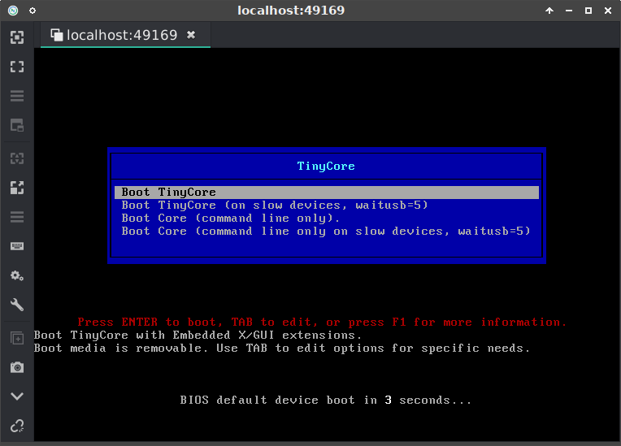
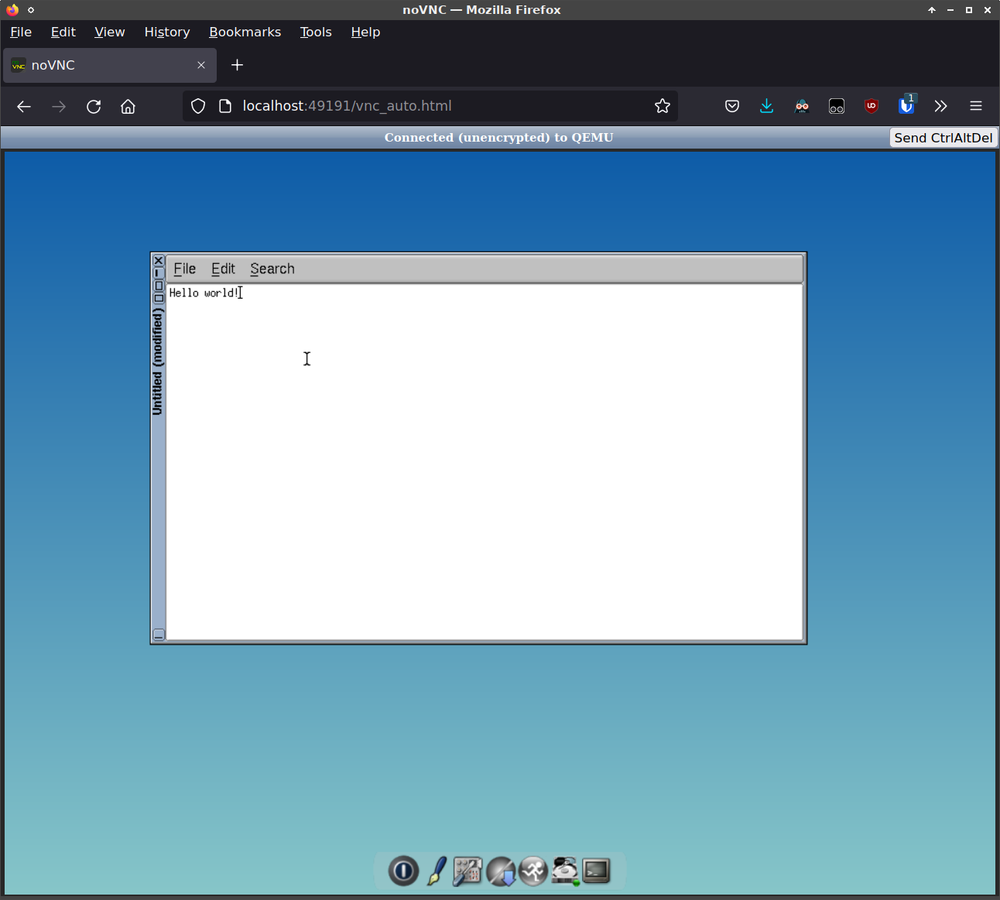
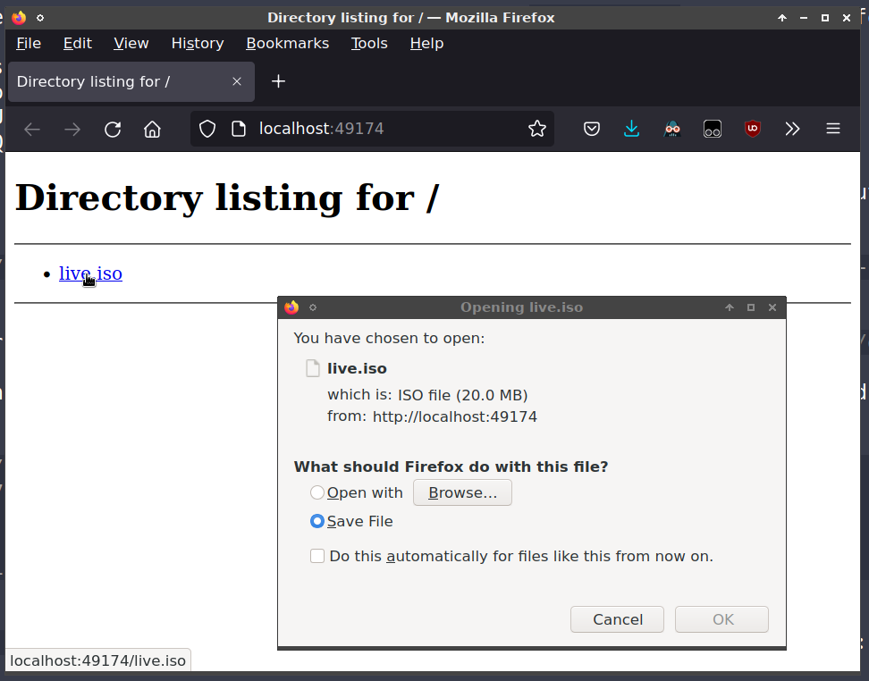

# docker-qemu-live-iso


This Docker image serves two purposes:

1. Boots a live ISO image in QEMU (based on [`tianon/qemu:native`](https://github.com/tianon/docker-qemu))
2. Provides an HTTP server from which the ISO itself can be downloaded

## Customizing the Docker image

By default this image is built with [Tiny Core Linux](http://www.tinycorelinux.net/) ISO as an example. Modify the `ISO_URL` argument when building the image to provide your own ISO URL. Or, create a child Dockerfile based on this image to add a local ISO:

```
FROM ghcr.io/mmguero/qemu-live-iso:latest

ARG QEMU_CPU=4
ARG QEMU_RAM=4096
ENV QEMU_CPU $QEMU_CPU
ENV QEMU_RAM $QEMU_RAM

ADD --chown=${DEFAULT_UID}:${DEFAULT_GID} foobar.iso /image/live.iso
```

## Running

Set the following environment variables to control runtime parameters. See the [`Dockerfile`](Dockerfile) for a complete list of environment variables.

* `QEMU_CPU` - the number of CPU cores for QEMU (default `2`)
* `QEMU_RAM` - the megabytes of RAM for QEMU (default `1024`)
* `QEMU_START` - whether to start QEMU when the container is run (default `true`)
* `QEMU_RESTART` - whether to retart QEMU if it stops (default `true`)

Additionally, you may bind mount your ISO as `/image/live.iso` in the container to boot your own ISO without rebuilding the Docker image:

```
$ docker run --detach --publish-all --rm --device /dev/kvm --volume /path/to/foobar.iso:/image/live.iso ghcr.io/mmguero/qemu-live-iso:latest
```

QEMU can take advantage of KVM acceleration if available. This can be accomplished by including `--device /dev/kvm` as illustrated in the example above.

Execute `docker run` with `--publish-all` (`-P`) and connect to the mapped HTTP and VNC ports to access the services provided by the container:

```
$ docker run --detach --publish-all --rm --device /dev/kvm ghcr.io/mmguero/qemu-live-iso:latest
fdaea77d8c383edc0689dd710b0df5c1187ad75b0b429e3ee56061d29fa6488c

$ docker ps -a | grep qemu-live-iso
fdaea77d8c38   ghcr.io/mmguero/qemu-live-iso      "/usr/bin/supervisor…"   10 seconds ago   Up 8 seconds    0.0.0.0:49190->22/tcp, 0.0.0.0:49169->5900/tcp, 0.0.0.0:49174->8000/tcp, 0.0.0.0:49191->8081/tcp   competent_black

```

### VNC client access

The VNC service is the one mapped to `5900/tcp`, and can be connected to with your VNC client of choice (`vncviewer`, `remmina`, etc.):

```
$ remmina vnc://localhost:49169
```



### VNC HTTP access

Alternately, an HTML VNC client ([noVNC](https://github.com/novnc/noVNC)) can be accessed via your browser at `http://localhost:XXXXX/vnc_auto.html`, where `XXXXX` is the port mapped to `8081/tcp`:



### ISO HTTP download

The HTTP service (for downloading the ISO) is the one mapped to `8000/tcp`, and can be accessed with a web browser:



## Security

Note that none of the services mentioned above are encrypted or otherwise secured. This image is intended for testing or internal use only, and may not be suitable for production use.